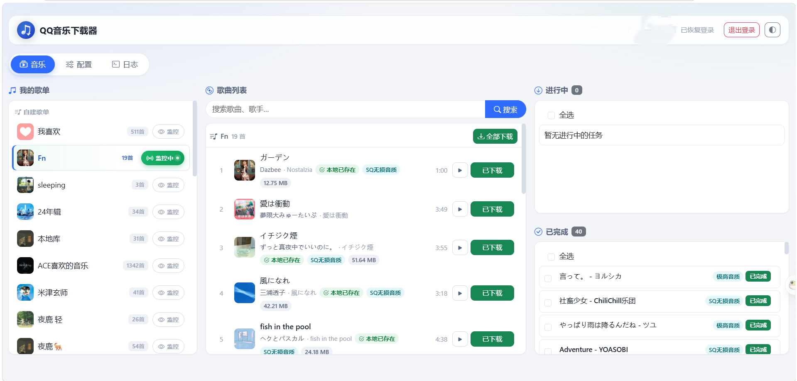

# QQ音乐下载器

一个功能强大的 QQ 音乐下载与歌单监控工具，提供 Web 界面，为您的音乐管理带来无缝体验。

> **当前版本：v0.9.3** ｜ 更新记录见 [CHANGELOG.md](CHANGELOG.md)

## 📷 界面预览



> 音乐页：左侧「我的歌单」（带封面与**监控中**状态）、中间歌曲列表（本地已存在 / 音质 / 体积一目了然、支持在线试听与整单下载）、右侧下载任务与已完成记录（含音质标识）。

## ✨ 功能特性

- **多方式登录**
  - QQ 扫码登录、微信扫码登录、手机号验证码登录
  - 登录态持久化，重启无需重新登录

- **歌单管理**
  - 浏览自建歌单与收藏歌单（带封面）
  - 查看歌单内所有歌曲，自动识别本地已下载的歌曲
  - 一键下载单曲或整个歌单

- **搜索下载**
  - 网页端搜索歌曲，直接加入下载队列
  - 实时查看下载进度（进行中 / 已完成 / 失败）

- **歌单监控**
  - 监控指定歌单，有新歌加入时自动下载
  - 多任务并行下载（并发数可配置），下载失败自动重试（重试间隔可配置）
  - **每歌单独立下载位置**：可为监控歌单指定专属下载目录，留空则用默认 `/app/downloads/save`
  - **每歌单独立的「按日期建文件夹」开关**：开启后按 `YYMMDD`（如 `261001`）分目录存放，默认关闭

- **下载管理**
  - 实时查看下载进度（进行中 / 已完成 / 失败）
  - 可**取消正在下载或排队**的任务，自动清理半成品文件
  - 「本地已存在」按**目标目录实际扫描**判断（下载历史仅作展示），并显示音质 / 大小 / 文件名
  - 本地已有文件的歌曲可**一键重新下载**（确认后覆盖），自动避免同名重复文件
  - 支持 OGG 与 MP3 的取舍：默认取该曲可用的最高音质；可勾选**优先 MP3**（避免个别播放器不支持 OGG）

- **网页播放器**
  - 支持在线试听：由服务端代理拉流（解决 CDN 为 http 时的混合内容问题），**支持拖动进度**（转发 Range 请求）
  - 底部播放条：通栏进度、缓冲状态、音量记忆、播放动效；歌名与歌手分行显示

- **自动写入歌曲信息**
  - 下载完成后自动写入标题 / 歌手 / 专辑 / 封面 / 年份等标签
  - 支持写入普通歌词、逐字歌词、翻译（可分别开关）
  - 可同时生成 `.lrc` 歌词文件

- **通知系统**
  - 企业微信群机器人、Bark、自定义 Webhook 三类通知
  - 支持下载成功（含保存位置）/ 下载失败 / 歌单更新 / **歌单下载结果汇总** / **账号登录失效**等事件推送
  - 歌单更新会发两条：更新提醒 + 该批下载跑完后的**完整歌单结果**（逐条标注状态与原因）

- **日志页**
  - 内置运行日志面板（保留最近 3000 条），支持自动刷新、只看警告/错误、清空

- **界面**
  - **浅色 / 深色 / 跟随系统** 三种主题，切换为整屏淡入淡出
  - 移动端专门适配（顶栏单行、歌曲行卡片化、播放条瘦身）
  - 统一的对话框组件（替代浏览器原生弹窗），危险操作有明确警示样式
  - 键盘快捷键：`空格`/`K` 播放暂停，`←`/`→` 快退快进 5 秒

## 🚀 Docker 部署

### 方式一：从源码构建（推荐，最稳妥）

```bash
git clone https://github.com/huohen92/QQMusic-monitor.git
cd QQMusic-monitor
docker compose build
docker compose up -d
```

仓库自带的 `docker-compose.yml` 已经把 `data/` 与 `downloads/` 映射到当前目录，无需额外配置。

### 方式二：使用现成镜像

```yaml
services:
  app:
    image: huohen92/qqmusic-monitor:v0.9.3
    container_name: QQMusic-monitor
    ports:
      - "6696:6696"
    environment:
      - TZ=Asia/Shanghai
    volumes:
      - ./data:/app/data
      - ./downloads:/app/downloads
    restart: unless-stopped
```

启动：

```bash
docker compose up -d
```

> 若该 tag 尚未推送到 Docker Hub，请改用「方式一」从源码构建，或把 `image:` 换成你自己的仓库地址。

### 方式三：docker run

```bash
docker run -d \
  --name QQMusic-monitor \
  --restart unless-stopped \
  -p 6696:6696 \
  -e TZ=Asia/Shanghai \
  -v ./data:/app/data \
  -v ./downloads:/app/downloads \
  huohen92/qqmusic-monitor:v0.9.3
```

### 目录说明

| 挂载目录 | 容器路径 | 作用 |
|---|---|---|
| `./data` | `/app/data` | 登录凭证、设备指纹、配置、任务历史、监控歌单 |
| `./downloads` | `/app/downloads` | 已下载的音乐文件 |

> 两个目录都会由程序自动创建，**但强烈建议持久化挂载**：`data/` 丢了等于每次重建都要重新登录并生成新设备。
>
> ⚠️ `data` 目录包含登录凭证与设备指纹，**请勿分享或提交到代码库**（仓库已通过 `.gitignore` 排除）。

## 📖 使用说明

1. 启动后访问 `http://<服务器IP>:6696`
2. 使用 QQ 扫码、微信扫码或手机号验证码登录
3. 在「配置」页可设置下载音质、并发数、歌词写入、通知、按日期建文件夹等
4. 在「配置」页「歌单下载位置」区可为每个监控歌单指定独立下载目录（留空使用默认 `/app/downloads/save`）
5. 点开歌单即可查看歌曲并下载；点击「监控」按钮可自动跟踪歌单更新
6. 本地已有文件的歌曲会显示「重新下载」按钮，点击后确认即可覆盖重下
7. 进行中/排队中的任务可点「取消」，正在下载的任务会中断并清理半成品文件
8. 顶栏右侧按钮可切换主题；「日志」页可查看运行日志
9. 部分设置项（如监控检查间隔）需要重启容器才能生效

## ⚠️ 注意事项

- **API 限制**：QQ 音乐对单个账号的下载量有限制（约 190 首/天）。触发后任务会自动进入冷却重试。
- **登录设备限制**：QQ 音乐限制账号的登录设备数量。`data/device.json` 记录了设备指纹，请保持挂载持久化，否则每次重启都会生成新设备，可能触发「登录设备超限」。
- **异地登录风控**：若在异地 IP 部署登录，可能触发腾讯风控（如「获取 code 失败」）。建议在目标服务器上首次登录，或使用手机号验证码登录。
- **不要使用多 worker 启动**：任务状态与监控批次保存在进程内存中，`--workers` 会导致状态不一致。
- **时区**：按日期建文件夹使用 `YYMMDD`，依赖容器时区，compose 中已设置 `TZ=Asia/Shanghai`。

## 🧰 常见问题（排错）

### 1. 启动报 `Conflict. The container name "/QQMusic-monitor" is already in use`

说明已经存在一个**同名容器**（多为之前手动 `docker run` 或 NAS 图形界面创建的容器）。因为 compose 里用了固定容器名 `container_name: QQMusic-monitor`，compose 无法覆盖一个「不是它自己创建」的容器，于是拒绝启动。

**先导出数据、再删旧容器**（若旧容器没做 `./data` 挂载，登录凭证就在它内部，直接删会一起丢掉）：

```bash
# 1) 查看同名容器及状态
docker ps -a --filter name=QQMusic-monitor

# 2) 把旧容器里的登录凭证/配置导出到当前目录（容器已停止也能拷）
mkdir -p ./data
docker cp QQMusic-monitor:/app/data/. ./data/

#   如果旧容器的音乐也在容器里（没挂载 downloads），一并导出：
#   mkdir -p ./downloads && docker cp QQMusic-monitor:/app/downloads/. ./downloads/

# 3) 删除旧容器
docker rm -f QQMusic-monitor

# 4) 用 compose 重新启动
docker compose up -d
docker compose logs -f
```

在 NAS 图形界面里操作时，等价做法是先在「容器」列表里**删除**那个同名容器，再重新部署。

### 2. 启动报 `Error: No such option '-u'`

v0.9.3 之前 `start.sh` 把 `-u`（Python 解释器的参数）写在了 uvicorn 后面，容器会启动即退出。已修复为 `exec python -u -m uvicorn ...`，请更新到 v0.9.3 或更新版本：

```bash
docker compose build --no-cache && docker compose up -d
```

### 3. 页面提示需要登录 / 提示登录失效

`data/` 没有持久化，或换了新的 `data/` 目录。确认「存储位置」里已把 NAS 文件夹映射到 `/app/data` 后重新登录；若反复失效，检查 `data/device.json` 是否被保留（设备指纹变化会触发风控）。

### 4. 端口被占用（6696 已被其他服务使用）

改 `docker-compose.yml` 的宿主机侧端口即可，容器侧保持 6696：

```yaml
    ports:
      - "8669:6696"   # 宿主机 8669 → 容器 6696
```

### 5. 下载的音乐在 NAS 上找不到

检查「存储位置」里 `/app/downloads` 是否映射到了你期望的 NAS 目录；页面右上角「配置 → 下载配置」里的下载目录也应是 `/app/downloads/save`（或用 `/app/downloads/<歌单名>`）。

## 🔨 本地开发

```bash
# 安装依赖
pip install -r requirements.txt

# 启动（默认端口 6696）
python -m uvicorn main:app --host 0.0.0.0 --port 6696
```

## 📁 模块说明

| 文件 | 作用 |
|---|---|
| `main.py` | FastAPI 入口与全部 HTTP 接口（歌单、下载、播放代理、日志、配置） |
| `qq_music.py` | 封装 `qqmusic-api-python`：登录、歌单、搜索、歌词、播放链接、音质排序 |
| `tasks.py` | 下载队列与 worker：并发控制、失败重试、标签与歌词写入、半成品清理 |
| `monitor.py` | 歌单监控：轮询新增歌曲、触发下载、汇总结果通知 |
| `notification.py` | 企业微信 / Bark / Webhook 通知（含长文本自动分片） |
| `config.py` | 配置读写与默认值、版本号常量 |
| `download_paths.py` | 下载目录规则（默认目录、歌单目录、按日期建文件夹） |
| `local_files.py` | 本地文件扫描与「已存在」判定、音质识别、体积格式化 |
| `tagging.py` / `utils.py` | 标签与封面写入、通用工具 |
| `log_store.py` | 内存日志环形缓冲（接管 stdout/stderr） |
| `templates/` `static/` | 前端页面、样式与脚本（原生 JS + Bootstrap 5） |

## 📄 License

本项目仅供个人学习与备份使用，请遵守 QQ 音乐用户协议及相关法律法规。请勿用于商业用途或大规模分发。

## 🙏 致谢与项目来源

本项目是在多个开源项目的基础上，结合 AI 辅助开发完成的功能整合版：

- **[Inrrs/QQMusic-monitor](https://github.com/Inrrs/QQMusic-monitor)** — 基础 Web 框架：登录、歌单浏览、下载队列、歌单监控、通知系统的原始实现
- **[L-1124/QQMusicApi](https://github.com/L-1124/QQMusicApi)**（`qqmusic-api-python` 0.7.x）— QQ 音乐 API 核心库，本项目的登录、搜索、歌词、播放、用户信息等全部基于其 Client / modules 架构
- **[xhongc/music-tag-web](https://github.com/xhongc/music-tag-web)** — 参考其标签写入思路，使用 [mutagen](https://mutagen.readthedocs.io/) 实现下载后自动写入标题、歌手、专辑、封面、歌词
- **AI 辅助开发** — 代码迁移、功能扩展与文档整理

在此基础上新增/增强的功能：企业微信纯文本通知、网页搜索下载、在线播放器（服务端代理）、自动写入歌曲信息与歌词、手机端 UI 适配、浅色/深色主题、统一对话框、每歌单独立下载目录、按日期建文件夹、下载取消与重新下载覆盖、账号失效通知、监控歌单显示真实名称、日志页、性能优化与稳定性修复等。
